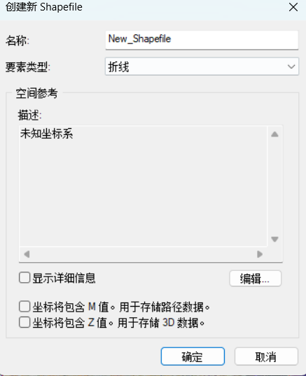

# arcgis遥感影像海岸线数据集制作

## 画陆地轮廓

1.打开目录

2.创建shapefile文件，命名"land"



3.编辑要素，创建要素，画陆地轮廓

## 建立陆地面要素
1.打开ArcToolBox——数据管理工具——要素——要素转面
[2.png](https://postimg.cc/kDSFScZR)

## 建立海洋面要素
1.画一个比原始影像图尺寸大的AOI（只做一个，全部图都用它）
2.打开ArcToolBox——分析工具——叠加分析——擦除
3.用AOI擦除polygon面，得到sea面要素
[3.png](https://postimg.cc/tnYxXFfn)

## 陆地和海洋合成一个面要素
1.地理处理——合并——命名为merge
[4.png](https://postimg.cc/fkrd8gt9)

## 制作栅格
1.打开merge面的打开数据表，创建字段class
[5.png](https://postimg.cc/qz63SX2V)
2.点击对应的区域，再右键点击class，打开字段计算器，将陆地输入4，海洋输入5
[6.png](https://postimg.cc/tshVCqrz)
3.打开ArcToolBox——转换工具——转为栅格——面转栅格——改参数和环境参数（注意这里的输出文件命名后缀带上.tif，负责它生成不出tif主文件，只会得到一个文件夹）
[7.png](https://postimg.cc/qh7tL8pF)
[8.png](https://postimg.cc/YLGvcMG3)
[9.png](https://postimg.cc/bGydyQDM)
[10.png](https://postimg.cc/DWx0881g)
4.搜索——栅格计算器——输入
```javascript
Con(Raster("mask.tif") == 4, 1, 0)
```
（这里文件输出也需要后缀带上.tif）

## 裁剪mask
1.打开ArcToolBox——Spatial Analyst工具——提取分析——按掩膜提取
[11.png](https://postimg.cc/0M3N0FWb)
